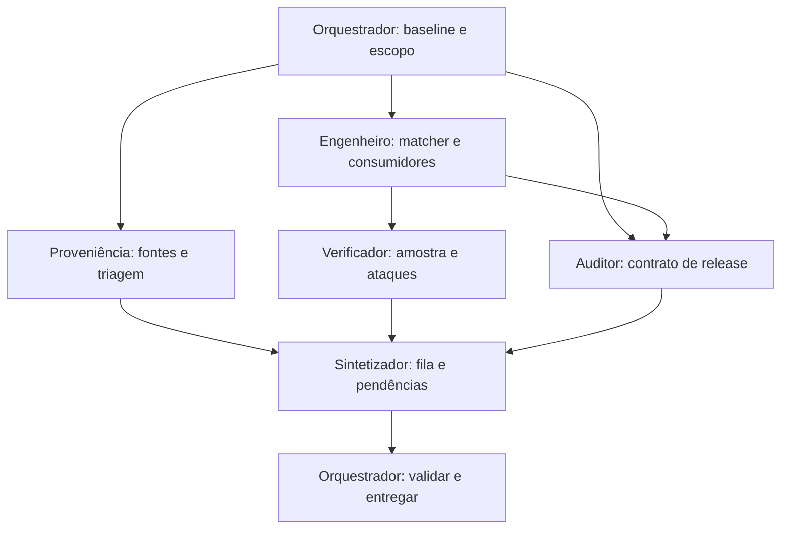

# Plano finito de reparo P7 — 06/09/2026

DOCUMENTADO: autorizado pelo usuário a concluir os ajustes técnicos necessários, com no máximo cinco subagentes e uma hora. Baseline medido em `BASELINE.json`; SHA-256 do ZIP de origem `21416ca72252856ce4d7b189b3f742a4bc1720d7f8276eec5ec31e4db92ed55f`. Não existe HEAD local da origem; commit herdado documentado `b0a9f23091e0cb92e97829e4d9d30fc05f51cf48`.

## Dependências e propriedade

Cinco subagentes no total; nenhum pode criar outros. Autoria da implementação, revisão adversarial e síntese são separadas. O orquestrador é responsável pela adjudicação técnica, reconciliação, embalagem e preservação.

## Decisões técnicas desta rodada

- A autorização posterior permite adaptar consumidores e teste que congelava 2.317 unresolved. Nenhuma mudança de denominador: 2.392 linhas, 52 claims, 17 gates.
- Correspondência documental é distinta de sustentação da claim pela página. O matcher não altera validade clínica.
- IDs completos explícitos múltiplos em spans separados são citações múltiplas, não candidatos concorrentes. Preservar os 8/75 casos legados; empates entre candidatos a referência inferida permanecem ambiguous.
- Inferências L1–L3 só podem usar o campo de fonte, nunca título/enunciado clínico da linha. Ausência explícita prevalece no registro de precisão.
- Catálogo deve declarar a política de agregação e os níveis usados; não pode atribuir fonte por simples menção de doença no corpo da cápsula.
- A taxonomia A–D está ausente do handoff. A classificação entregue deve identificar sua definição como operacional desta rodada, nunca herdada.
- A amostra de L0 usará controles legados: não existem novos exact quando L0 é preservado. Se algum nível não tiver cinco novos casos reais, não completar com casos sintéticos apresentados como reais.

## Gates e limites

VERIFICADO baseline: 53/54 testes passaram e 1/54 foi ignorado por ausência de fixture; 0 falhas. Os 17/17 gates estão documentalmente passed na v1.5.0; o validador mecânico passou, sem provar reexecução das jornadas históricas.

O aceite literal de 54/54 e a reexecução integral de 17/17 não serão alegados por troca de denominador, reconstrução fictícia de fixture ou renovação cosmética de hash. Regressão material de gate determina parada de integração; no máximo uma rodada de reparo do matcher após revisão adversarial. Artefatos revisáveis podem ser entregues com HOLD quando faltarem requisitos de liberação.

## Fontes e segurança

Listar documentos curriculares e páginas antes de qualquer pesquisa clínica externa. Os PDFs não acompanham o ZIP; `source_unavailable` descreve a verificação desta sessão, sem sobrescrever `confirmed` herdado. Buscar uma diretriz não substitui a fonte da aula. W1 e W3 não recebem resultados inventados para fechar filas: sem PDF, sem pesquisa clínica que viole a sequência; sem provas originais, sem frequência quantitativa nova.

Zero promoções automáticas, zero alteração de cápsulas ou enunciados clínicos e preservação do conflito de febre materna. Autorização técnica ampla não é assinatura humana de leitura de evidência clínica.

## Entregáveis

Baseline imutável; implementação e verificações reproduzíveis; delta de todas as linhas; MATCH_SAMPLE; QUARANTINE_TRIAGE; SOURCE_REQUESTS; CLINICAL_REVIEW_QUEUE; auditoria dos gates; relatório final; pacote revisável e patch. O registro final discrimina VERIFICADO, DOCUMENTADO, INFERIDO, CONFLITO, PENDÊNCIA e DECISÃO HUMANA NECESSÁRIA.
